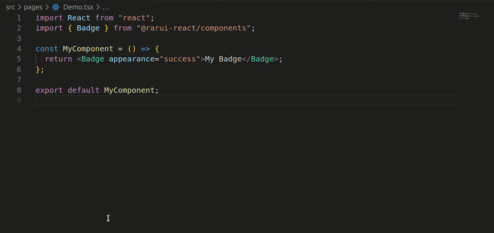
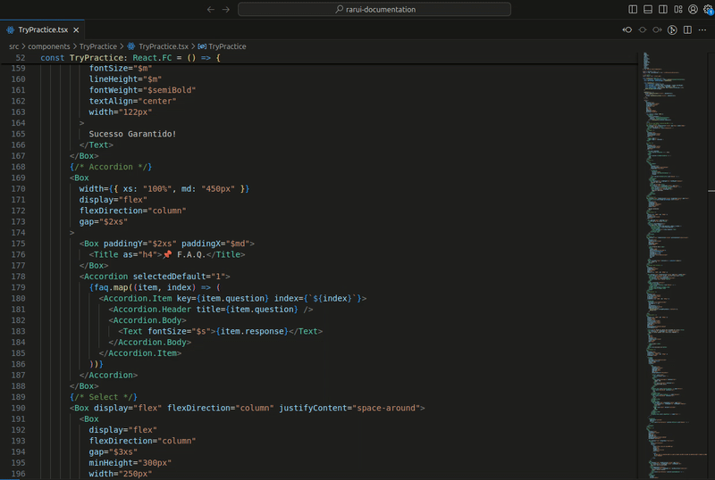

#  Rarui Helper

> Boost your productivity with **Rarui Helper**! A magical extension to VS Code that brings complete documentation of all available components and their properties all into your favorite design system. Write stylish code, accelerate development, and break into the programming clouds with the [Rarui Design System](https://rarui.rarolabs.com.br/). 💨✨"

## 🗃️ Overview

The **Rarui Helper** extension is a powerful tool for developers working with VS Code. It is designed to streamline and enhance your workflow, offering advanced and customized features to maximize productivity.

## ✨ Features

- **Real Time Documentation**: Get comprehensive and detailed information about the properties and components of your Design System directly in the editor, providing a more intuitive development.
- **Custom Hover**: View tooltip-style documentation when hovering over components and properties, providing a quick and easy understanding of your Design System.
- **Rarui Dependencies Check**: Automatically check for outdated Rarui dependencies in your project's package.json. If any outdated dependency is found, you will be notified with information about the current version in your project and the latest version available on npm. Click the "Check on npm" button to see all available versions on npm.

## 🚀 Getting Started

1. Open Visual Studio Code.
2. Go to the extensions tab (click the puzzle icon in the left sidebar).
3. Search for "Rarui Helper".
4. Click "Install" to install the extension.
5. Restart Visual Studio Code if prompted.

## 💻 Usage

1. Open a file of your project or go to a file of type `*.jsx` or `*.tsx`.
2. When writing code, the extension will analyze your code.
3. Mouse over components and properties to see real-time documentation.

## ⚙️ Commands

- **Check for updates to rarui packages**: This command checks your project's package.json for outdated Rarui dependencies. If any outdated dependency is found, a notification will be shown with information about the current version in your project and the latest version available on npm. You can click the "Check on npm" button in the notification to see all available versions on npm.

> To execute the command, press `Ctrl+Shift+P` to open the command palette, type "Check for updates to rarui packages", and select the command.   >
> 

## 📄 License

Licensed under the MIT License, Copyright © 2024-present [Rarolabs](https://rarolabs.com.br/).
